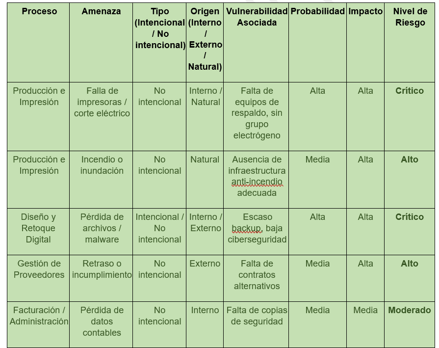
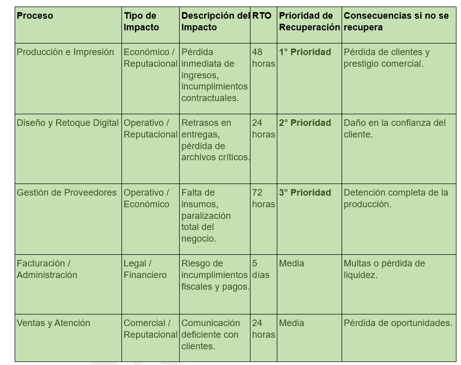

# Business Continuity Plan (BCP) – Vino Print

## Descripción

Desarrollo de un Plan de Continuidad de Negocio (PCN) para una empresa del sector vitivinícola, enfocado en garantizar la resiliencia operativa ante incidentes críticos.
------------------------------------------	-----------------------------------------

## Objetivo

Restablecer operaciones críticas en un máximo de 48 horas, minimizando impacto operativo, financiero y reputacional.

------------------------------------------	-----------------------------------------

## Procesos críticos identificados

- Producción e impresión de etiquetas
- Diseño y retoque digital
- Gestión de proveedores

------------------------------------------	-----------------------------------------

## Análisis de riesgos

Se evaluaron amenazas:

- Naturales: cortes eléctricos, incendios
- Tecnológicas: fallos, pérdida de datos
- Humanas: errores, sabotaje

------------------------------------------	-----------------------------------------

## Impacto del negocio (BIA)

- Definición de RTO por proceso
- Evaluación de impacto económico y reputacional
- Priorización de recuperación

------------------------------------------	-----------------------------------------
## Estrategias implementadas

- Backups automatizados
- Energía alternativa (UPS)
- Diversificación de proveedores
- Protocolos de comunicación
- Capacitación del personal

------------------------------------------	-----------------------------------------
## Escenario de contingencia

Corte eléctrico prolongado:

- Activación del plan
- Continuidad operativa mínima
- Restablecimiento total
------------------------------------------	-----------------------------------------

## Normativas aplicadas

- ISO 22301
- ISO/IEC 27001

---------------------------------------------	-----------------------------------------

## Documentación completa

Ver documento completo:

------> ./docs/PCN_Vino_Print.pdf

---------------------------------------------	-----------------------------------------

## Disclaimer

Proyecto realizado con fines educativos basado en un caso real.