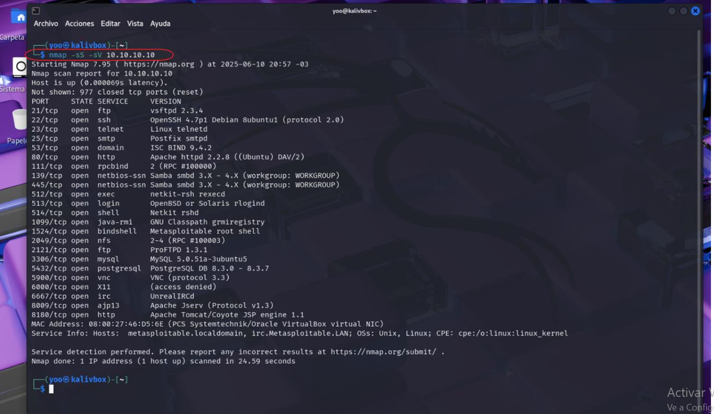
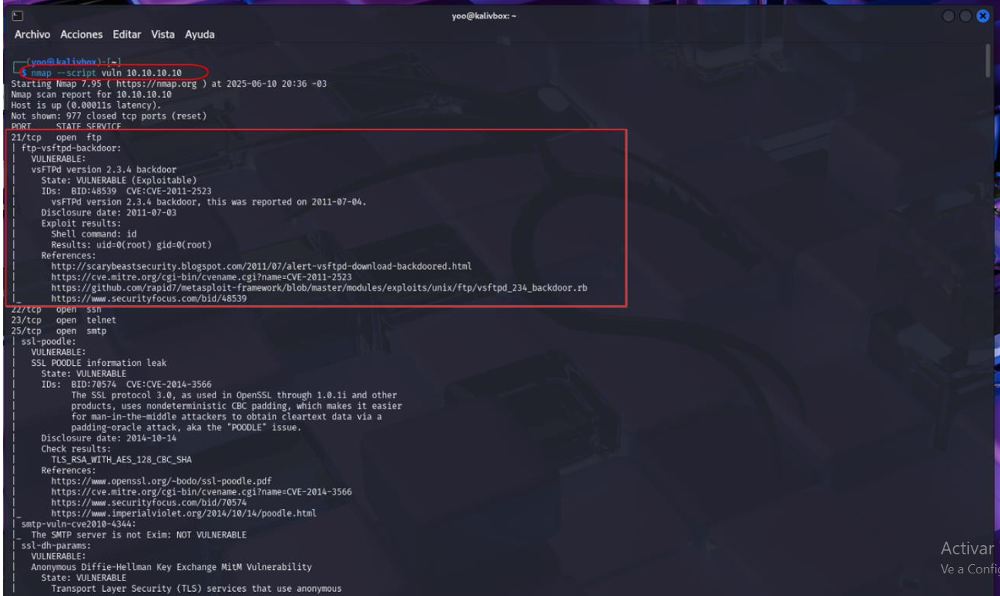
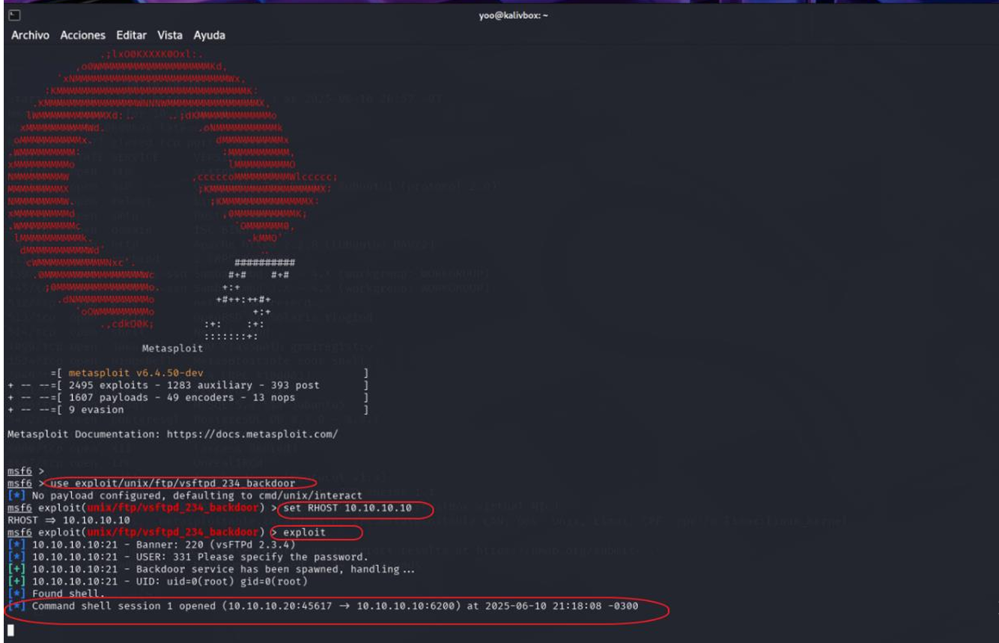
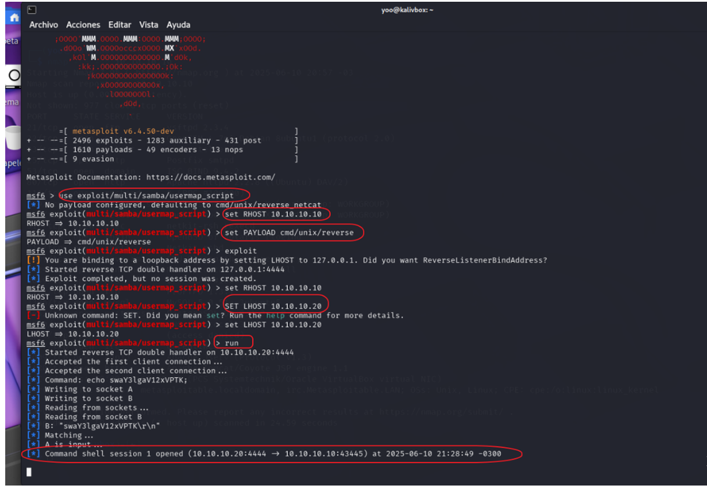
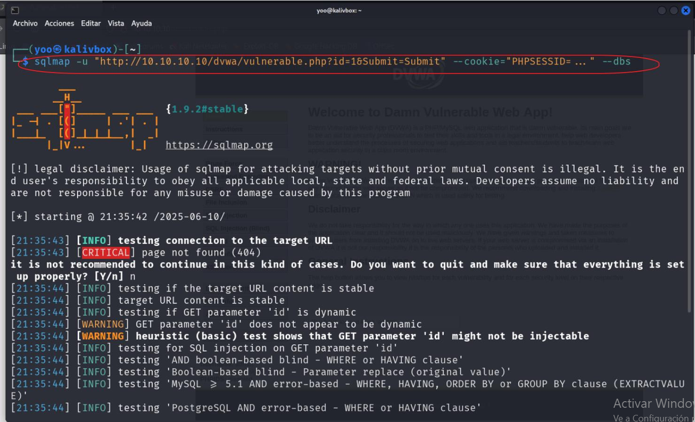

# Vulnerability Assessment & Exploitation – Metasploitable2

## Descripción

Análisis de vulnerabilidades y explotación en entorno controlado utilizando herramientas de pentesting.

## Objetivo

Identificar y explotar vulnerabilidades en Metasploitable2.

## Reconocimiento

Se utilizó Nmap para escaneo activo:

- Detección de puertos abiertos
- Identificación de servicios y versiones

## Análisis de vulnerabilidades

Uso de scripts de Nmap:

- nmap --script vuln

## Explotación

### 1. VSFTPD Backdoor (Puerto 21)

- Acceso remoto mediante exploit
- Obtención de shell

### 2. Samba Usermap Script

- Explotación de servicio SMB
- Ejecución remota de comandos

## Explotación Web

### DVWA (Damn Vulnerable Web App)

- Ataque SQL Injection con sqlmap
- Enumeración de bases de datos

## Herramientas utilizadas

- Nmap
- Metasploit
- sqlmap

## Resultado

Se logró comprometer el sistema objetivo mediante múltiples vectores:

- Acceso remoto
- Ejecución de comandos
- Extracción de información

